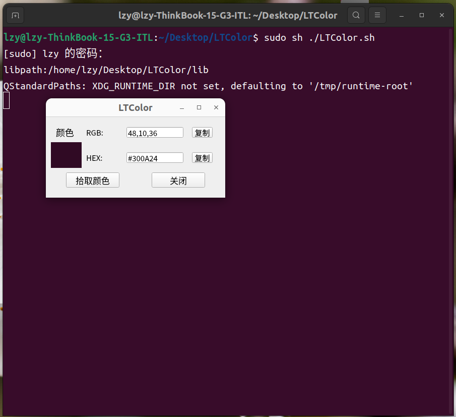
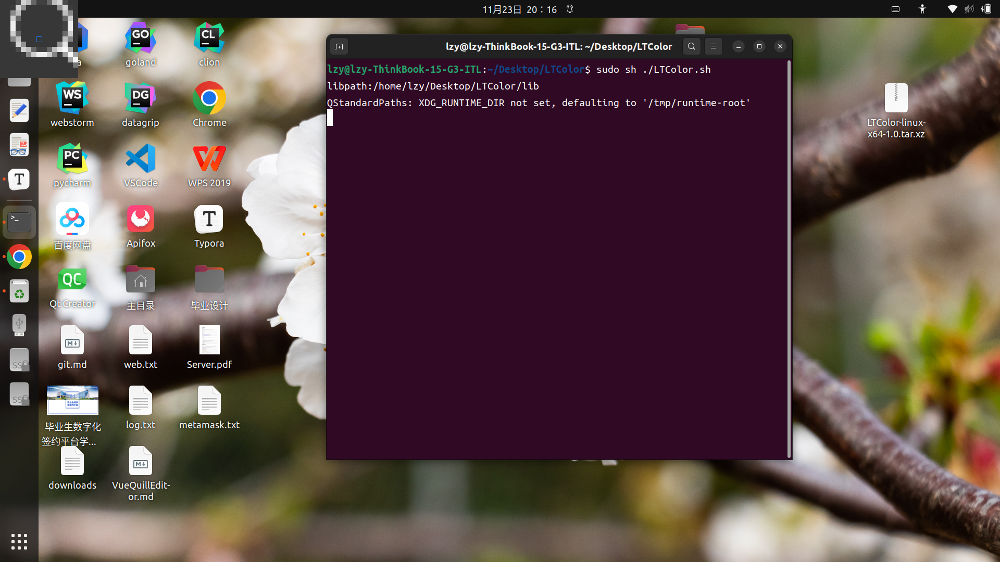
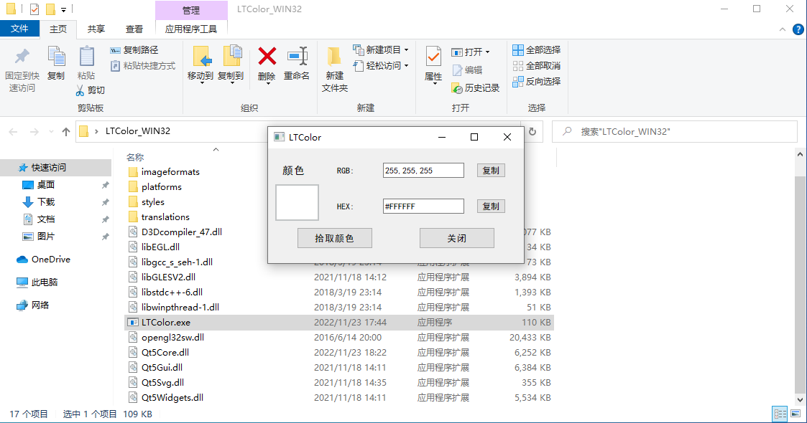

# LTColor

一个简易的跨平台屏幕取色器，基于Qt开发。

# 1.下载

<a href="https://github.com/543211494/LTColor/releases/tag/2022-11-23">点击此处</a>获取已经打包好的程序，解压即用。

# 2.介绍

该程序的原理很简单，取色时先抓取全屏。再打开一个全屏窗口，将之前抓取的全屏作为背景。同时该全屏窗口有一个子窗口，在子窗口上放大绘制当前鼠标附件15x15的像素点，作为放大镜帮助取色。

# 3.使用

## 3.1ubuntu下使用

```shell
#下载并解压
tar xvJf LTColor-linux-x64-1.0.tar.xz
#进入解压后所在文件夹目录启动程序
sudo sh ./LTColor.sh
#如果出现黑屏的情况可能是开启了wayland,
#vi /etc/gdm/custom.conf,令WaylandEnable=false重启即可
```

运行截图如下，图二左上角为放大镜。





## 3.2windows下使用

解压，双击LTColor.exe即可。

